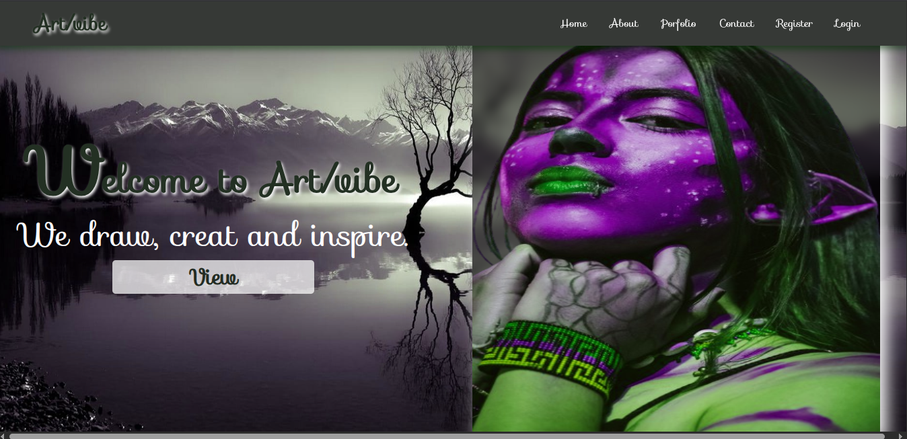

# 🎨 Art Gallery – Laravel Frontend

A beautifully designed and responsive **frontend** for an online art gallery, built using **Laravel Blade**, **TailwindCSS**, and custom CSS. This UI showcases artworks in an elegant, user-friendly layout optimized for both desktop and mobile devices.

> 🚧 **Note:** This project is **still in progress**. It currently includes the frontend UI only, with no backend logic, database, or authentication implemented yet.

---

## 🎯 Features

- 🖼️ Featured artwork slider / gallery layout  
- 📁 Categorized art collections  
- 🔍 Artwork details with description, price, and artist info  
- 🧩 Modular Laravel Blade components  
- 📱 Fully responsive design  
- 🎨 TailwindCSS + custom CSS styling  
- 🧭 Basic Laravel routing  

---

## 🛠️ Tech Stack

- ⚙️ Laravel 10+  
- 💡 Blade templating engine  
- 🎨 TailwindCSS  
- 🖌️ Custom CSS  
- 🌐 Laravel routing (no backend logic)  

---

## 🖼️ Screenshots

### 🏠 Homepage  

---

## 🚧 Project Status

🔨 **Frontend UI**: In Progress  
❌ **Backend features** (CRUD, login, checkout): Not implemented yet  

---

## 📝 Setup Instructions

   git clone https://github.com/Osinemem1/art-gallery.git
   cd art-gallery
